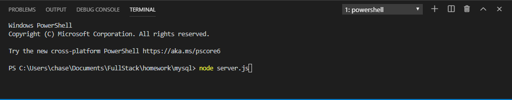
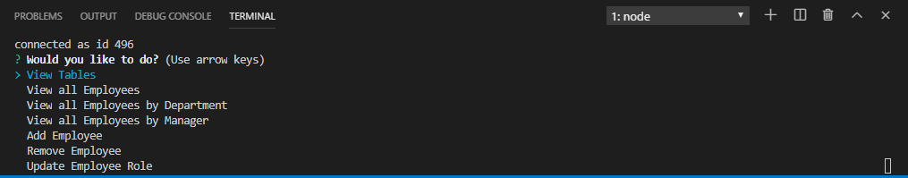
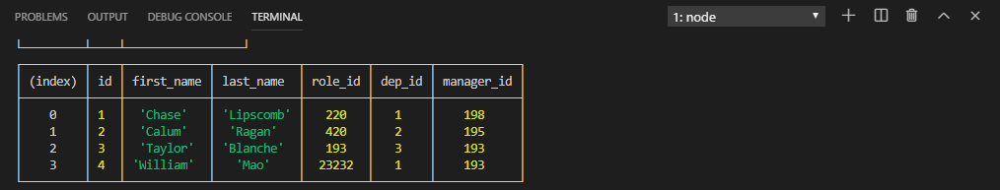
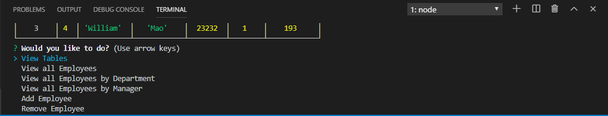

# mysql
This project is a mysql database that allows the user to access data inside the database as well as update and input information about the data.

Step 1: Start server in Node

Step 2: Select the option you want

Step 3: Data is displayed and after a certain amount of time will reboot

Step 4: After a few seconds you will be prompted again for more choices

